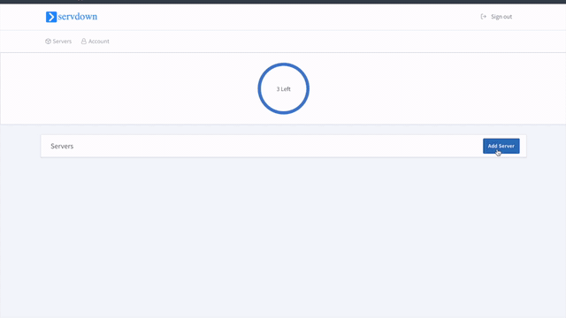

# Landing Page with Hipporello, Servdown and Vercel
This landing page and tutorial created for quick start to [Hipporello](https://www.hipporello.com), [Vercel](https://vercel.com) and [Servdown](https://servdown.com) usages.

https://landing-page-hipporello-servdown.vercel.app

&emsp;&emsp;
 
&emsp;&emsp;
 
&emsp;&emsp;

## Step by step:
1) Create a repository for your bootstrap landing page.
2) Deploy it into [Vercel](https://vercel.com) easily. Just login and add your repository. [Vercel](https://vercel.com) is a service for hosting static pages freely. It can also serve dynamic pages via [Next.js](https://nextjs.org) server side rendering (I'll test it later with React).
3) Register the [Servdown](https://servdown.com) for checking status/heartbeat of your service. [Servdown](https://servdown.com)  is the good option for server&service monitoring.
    

4) For using [Hipporello](https://www.hipporello.com) you just need a trello account and match a board. Then you can use and customize preset forms.
    to be continued...
